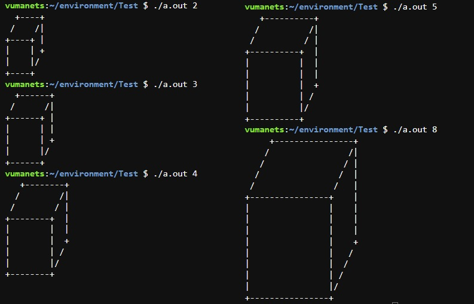
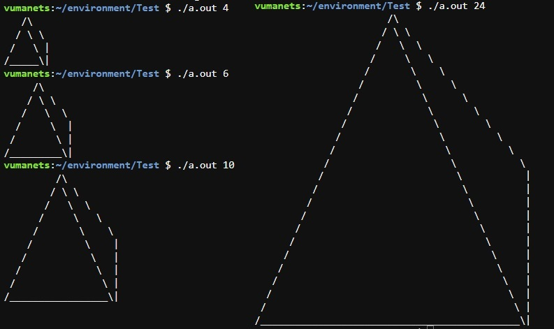

# How to create C programs that prints 3D shapes to standard output?
As a beginner programmer, you should practice these patterns to get a good grasp of logical thinking and program flow control.
In this exercise, we created two 3D shapes: a cube and a pyramid.
Each of them can be scaled through the input argument of the program - n.

## Description of the task for cube:
Create a program that prints a representation of a 3d cube to the standard output. The size of the cube depends on the variable `n`  which is passed to the program as a parameter in command line.
- you can use only `+` , `-` , `/` , `|`  and `space` characters to draw a cube
- number of `|`  in one vertical line equals to `n`
- number of `-`  in one horizontal line equals to `2 * n` 
- number of `/`  in one diagonal line equals to `n / 2` 
A cube can be produced only if `n > 1`. Otherwise, the program does not print anything.
Code of the program [cube.c](cube.c)

#### CONSOLE OUTPUT



## Description of the task for pyramid:
- you can use only `/`,`\`, `|`,`_` and space to draw a pyramid 
- the number of `/` in line that relates to the front triangle, equals to `n` 
- the number of `\` in line that relates to the front and side triangles, equals to `n - 1` 
- the number of `\` in line that relates only to the side triangle, equals to `n / 2` 
- the number of `|` in vertical line equals to `n / 2` 
- the number of `_` in horizontal line equals to `2 * n - 3` 
A pyramid can be produced only if its size is `even` and `n> 1`. Otherwise, the program does not print anything.
Code of the program [pyramid.c](pyramid.c)

#### CONSOLE OUTPUT



## Required knowledge
[Basic C programming](https://younglinux.info/c/), `Operators`, `If else`, `For loop`
 
## General algorithm for solving tasks using the pyramid as an example

The functionality of the main section is to take argument `n` from command line, convert it to `int` and call the pyramid print function: `void mx_pyramid (int n);`  passing it the parameter `n`, which determines the size of the pyramid.
```c#
int main (int argc, char* argv[]) {
	if (argc == 2) {
		mx_pyramid(atoi(argv[1]));
	}
	else
		return 1;
}
```
Next, we will consider the part of the program designed to print characters from a two-dimensional array of specified sizes. 
```c#
	for (int i = 0; i < h; i++){
		for (int j = 0; j < ln; j++){
     		if (pyr[i][j] != 0)
     			write (1, &pyr[i][j], 1);
		}
		write (1, &EOL, 1);
	}
```
The size of the array depends on `n` and is determined at the beginning of the functions:
```c#
	int ln = n * 2;
	int h = n;
	char pyr[h][ln];
```
Now let's look at filling an array with symbols to create a shape. First, we need to separate the figure into parts, the construction of which can be converted into algorithms. In the case of a pyramid, there are four of them, each of them is a different algorithm for filling the array. For clarity, below are sections of the program code with the output to the console of symbols with which they fill the array `pyr[][]`
###  top of pyramid
```c#
	for (int j = 0; j < ln - 1; j++)
	{
		if (j == ln / 2 - 1)
			pyr[0][j] = '/';
		else if (j == ln / 2)
			pyr[0][j] = '\\';
		else if (j < ln / 2 - 1 )				// `                   /\$
			pyr[0][j] = ' ';
		else
			pyr[0][j] = 0;
	}
```
### middle part of pyramid
```c#
	for (int i = h / 2 - 1, zad = 1; i > 0; i--, zad += 2)
	{
		for (int j = 0; j < ln; j++)
		{
			if (j == h - i - 1)
				pyr[i][j] = '/';			// `                  / \ \$
			else if (ln - j - 2 == h - i - 1)		// `                 /   \  \$
				pyr[i][j] = '\\';			// `                /     \   \$
			else if (j == ln - zad - 1)			// `               /       \    \$
				pyr[i][j] = '\\';			// `              /         \     \$
			else if (j <= ln - zad - 1)			// `             /           \      \$
				pyr[i][j] = ' ';			// `            /             \       \$
			else						// `           /               \        \$
				pyr[i][j] = 0;				// `          /                 \         \$
		}
	}
```
### back of pyramid
```c#
	for (int i = h - 2; i >= n / 2; i--)				// `         /                   \         |$
	{								// `        /                     \        |$
		pyr[i][ln - 1] = '|';					// `       /                       \       |$
		for (int j = 0; j < ln - 1; j++)			// `      /                         \      |$
		{							// `     /                           \     |$
			if (j == h - i - 1)				// `    /                             \    |$
				pyr[i][j] = '/';			// `   /                               \   |$
			else if (ln - j - 2 == h - i - 1)		// `  /                                 \  |$
				pyr[i][j] = '\\';			// ` /                                   \ |$
			else
				pyr[i][j] = ' ';
		}
	}
```
### base of pyramid
```c#
	pyr[h - 1][0] = '/';						// `/_____________________________________\|$
	pyr[h - 1][ln - 1] = '|';
	pyr[h - 1][ln - 2] = '\\';						
	for (int j = 1; j < ln - 2; j++)
		pyr[h - 1][j] = '_';
```

## [Go back](../README.md)

